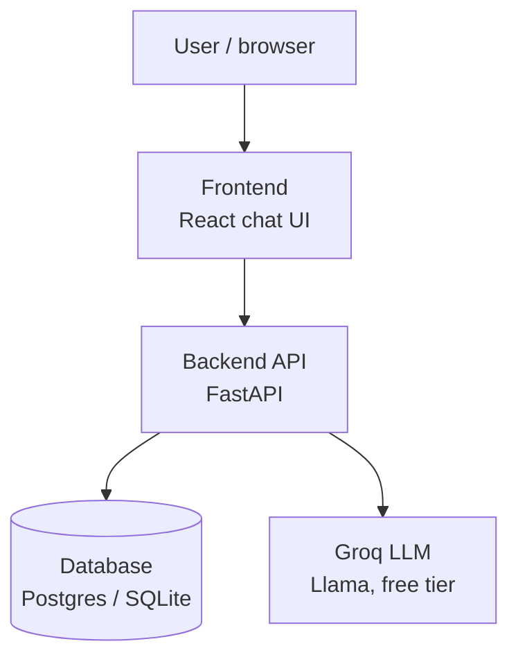
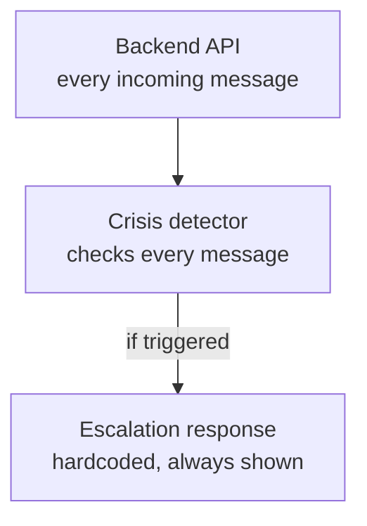

# System architecture

## Overview

- **Frontend** — React + Vite single-page app. Renders the chat UI, the mode toggle, the archive, and the ledger. Talks only to the backend API, never directly to Groq.
- **Backend API** — FastAPI. Owns all business logic: conversation handling, auth, snippet storage, ledger aggregation, and the crisis-detection pass. The only component with the Groq API key and database credentials.
- **Database** — SQLite for local development, Postgres (via Supabase or Neon's free tier) in production. Holds users, conversations, snippets, and ledger events.
- **Groq LLM** — free-tier hosted inference of open-weight models (Llama 3.x). Used for both the reflective conversation and the crisis-language classification pass. No paid AI API anywhere in this stack.

## Crisis safety layer

This runs as a separate pass on every message, independent of conversation mode (reflective vs. comfort/calm). It does not rely on the main conversational model's in-context judgment — the detector is a distinct classification step, and the escalation response (real crisis resources) is hardcoded rather than model-generated, so it can't be argued out of or missed by a bad completion.

## Data flow summary

1. User sends a message from the frontend.
2. Backend runs the crisis detector first, on every message, before anything else.
3. If triggered: hardcoded escalation response is returned immediately.
4. If not triggered: backend builds the appropriate system prompt (reflective or comfort/calm mode) and calls Groq.
5. Response is returned to the frontend and, where relevant, tagged and logged to the database (for the snippet archive or the reflection ledger).

## Explicitly out of scope for this architecture (see `scope.md`)

Growth Constellations, predictive pattern-detection check-ins, and the external Wisdom Engine/RAG are not represented here — they introduce a vector database and a licensed content corpus that this MVP does not need.
