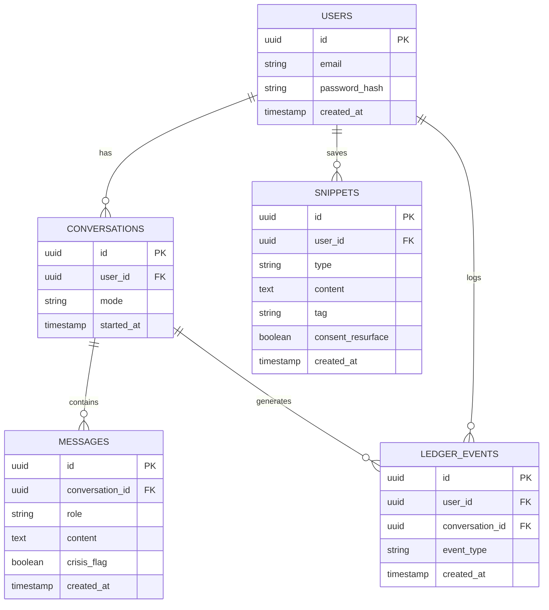

# Data model

## Table notes

- **users** — `password_hash` only, never plaintext (see the security architecture doc from the earlier full-scope plan for hashing details).
- **conversations** — `mode` is `"reflective"` or `"comfort"`; drives which system prompt the backend uses for that session.
- **messages** — `role` is `"user"` or `"assistant"`. `crisis_flag` is set by the crisis-detection pass and is the only place crisis-related state is stored — no separate "crisis history" table, keeping this data minimal and easy to fully delete.
- **snippets** — one merged table for Future Self Letters, Self-Compassion Scripts, and saved quotes; `type` distinguishes them, `tag` is the category used for later resurfacing matches. `consent_resurface` is enforced at the query layer, not just hidden in the UI — a resurfacing query filters on this column directly.
- **ledger_events** — `event_type` is `"validation_seeking"` or `"self_trust"`. This is the only table the weekly ledger reads from; it deliberately does not store raw conversation content, only the tag and a timestamp.

## What's deliberately NOT modeled yet

No tables for Growth Constellations, external wisdom corpus, or predictive check-in schedules — those belong to later phases and would add schema complexity this MVP doesn't need.

## Data minimization note

Per the scope doc: full raw conversation transcripts are not retained long-term. `messages.content` supports the live conversation and the session's tagging pass, but the retention/deletion policy (built in Phase 2/3) will summarize-then-discard older raw content rather than keeping it indefinitely.
